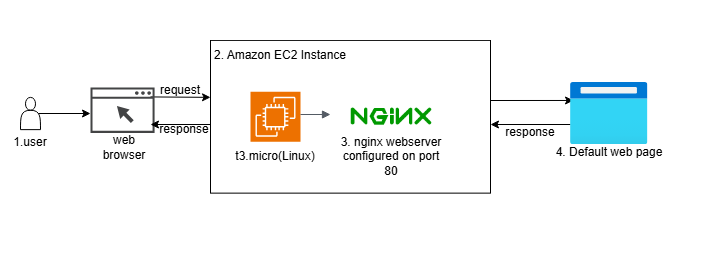
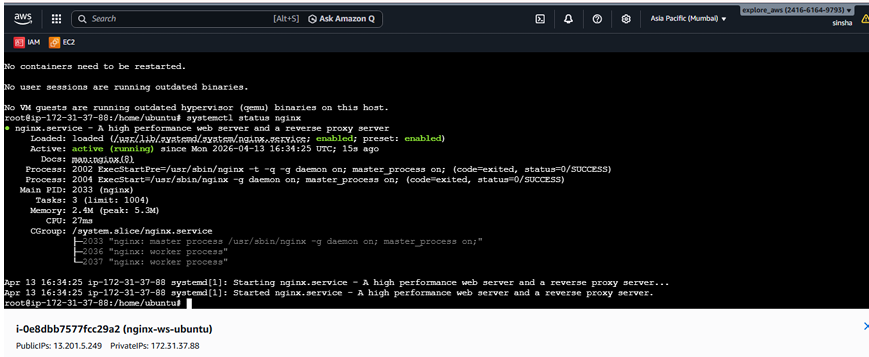
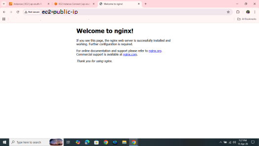
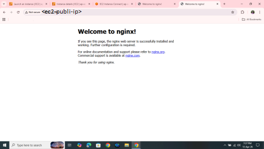
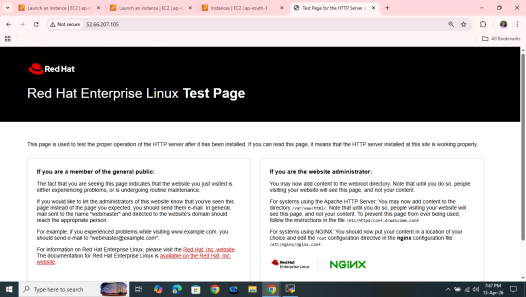
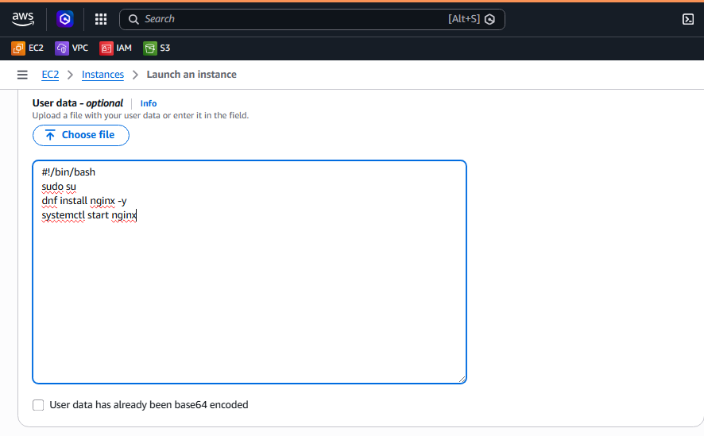

# Nginx Server Setup on AWS EC2 (Amazon Linux, Ubuntu & Red Hat)

> Deploying and automating Nginx across Amazon Linux, Ubuntu, and Red Hat EC2 instances using manual setup and EC2 User Data (Bash scripts).

---

## Project Overview

This project demonstrates how to set up and configure an **Nginx web server** on AWS EC2 instances running three different Linux distributions:

- ✅ Amazon Linux 2
- ✅ Ubuntu Server 24.04 LTS
- ✅ Red Hat Enterprise Linux (RHEL) 10

Two approaches are covered:
1. **Manual setup** via SSH terminal commands
2. **Automated setup** using EC2 **User Data (Bash scripts)** — no manual intervention required after launch

---

## Architecture Diagram

### Traffic Flow
```
Internet
   │
   ▼
[Browser] ──HTTP:80──► [EC2 Instance (Public IP)]
                              │
                         [Security Group]
                         - SSH   (Port 22)
                         - HTTP  (Port 80)
                              │
                         [Nginx Server]
                         - Default Web Page
```
---

## Prerequisites

Before launching instances, complete the following in your AWS account:

| Step | Action |
|------|--------|
| 1 | Log in to AWS Console and select a region (e.g., Mumbai `ap-south-1`) |
| 2 | Create a **Key Pair** in the selected region |
| 3 | Navigate to **EC2 → Network & Security → Security Groups** |
| 4 | Create a Security Group allowing **SSH (Port 22)** and **HTTP (Port 80)** inbound |

---

##  Part 1: Manual Setup

### Launch an EC2 Instance

1. Go to **EC2 → Launch Instance**
2. Set a name (e.g., `nginx-ws-amazonlinux`)
3. Select the appropriate AMI (free tier eligible)
4. Choose instance type: `t3.micro`
5. Attach the Key Pair and Security Group created above
6. Launch the instance

---

### 1️⃣ Amazon Linux 2

**Connect:** Use **EC2 Instance Connect** (browser-based SSH) from the AWS Console.

```bash
sudo su
dnf update -y
dnf install nginx -y
systemctl start nginx
systemctl status nginx
```

---

### 2️⃣ Ubuntu Server

**Connect:** Use **EC2 Instance Connect** or SSH with your key pair.

```bash
sudo su
apt update -y
apt install nginx -y
systemctl start nginx
systemctl status nginx
```

> **Note:** On Ubuntu, Nginx starts automatically after installation. `systemctl start nginx` is a safeguard.

---

### 3️⃣ Red Hat Enterprise Linux (RHEL)

**Connect:** Use **MobaXterm** or **PuTTY** with your `.pem` key pair.

```bash
sudo su
dnf update -y
dnf install nginx -y
systemctl start nginx
systemctl status nginx
```

---

### ✅ Verify — All Distributions

After starting Nginx verify nginx service is active and running
#### Ubuntu nginx status for reference
<br/>

Then copy the **Public IPv4 address** of the instance and open it in a browser:

```
http://<PUBLIC_IP_OF_INSTANCE>/
```

You should see the **Nginx default welcome page**.

| Distribution | Default Page |
|---|---|
| Amazon Linux | "Welcome to nginx!" |
| Ubuntu | "Welcome to nginx!" |
| Red Hat | Red Hat Enterprise Linux Test Page |

### 📸 Screenshots

<table>
  <tr>
    <td align="center">
      <br/>
      <b>Amazon Linux</b>
    </td>
    <td align="center">
      <br/>
      <b>Ubuntu</b>
    </td>
    <td align="center">
      <br/>
      <b>Red Hat</b>
    </td>
  </tr>
</table>

##  Part 2: Automated Setup via EC2 User Data

Skip manual SSH entirely — Nginx installs and starts automatically when the instance boots.

### How to Add User Data

1. Go to **EC2 → Launch Instance**
2. Configure name, AMI, instance type, Key Pair, and Security Group as usual
3. Expand **Advanced Details**
4. Scroll down to the **User data** field
5. Paste the appropriate script below
6. Click **Launch Instance**
7. Once running, open `http://<PUBLIC_IP>/` in a browser

#### Screenshot of user data page
<br/>
---

### 1️⃣ Amazon Linux — User Data Script

```bash
#!/bin/bash
sudo su
dnf install nginx -y
systemctl start nginx
```

---

### 2️⃣ Ubuntu — User Data Script

```bash
#!/bin/bash
sudo su
apt update -y
apt install nginx -y
systemctl start nginx
```

---

### 3️⃣ Red Hat (RHEL) — User Data Script

```bash
#!/bin/bash
sudo su
dnf update -y
dnf install nginx -y
systemctl start nginx
```

---

##  Command Reference Summary

| Task | Amazon Linux / RHEL | Ubuntu |
|------|---------------------|--------|
| Update packages | `dnf update -y` | `apt update -y` |
| Install Nginx | `dnf install nginx -y` | `apt install nginx -y` |
| Start Nginx | `systemctl start nginx` | `systemctl start nginx` |
| Check status | `systemctl status nginx` | `systemctl status nginx` |
| Package manager | `dnf` | `apt` |

---

##  Expected Outcomes

- ✅ Nginx is successfully running on **all three** Linux distributions
- ✅ The default web page is accessible via the instance's **Public IP** in any browser
- ✅ The **User Data automation** eliminates any need for manual post-launch configuration

---

## 📁 Repository Structure

```
ec2-nginx-webserver/
├── README.md
├── scripts/
│   ├── amazon-linux-userdata.sh
│   ├── ubuntu-userdata.sh
│   └── redhat-userdata.sh
└── screenshots/
    ├── ubuntu-nginx-status.png
    ├── amazon-linux-nginx.png
    ├── ubuntu-nginx.png
    ├── redhat-nginx.png
    └── ec2-user-data-page.png
      
     
```

---

## 🛠️ Tech Stack


---

##  Author

**Sinsha** — [GitHub](https://github.com/sinsha-c)

---
